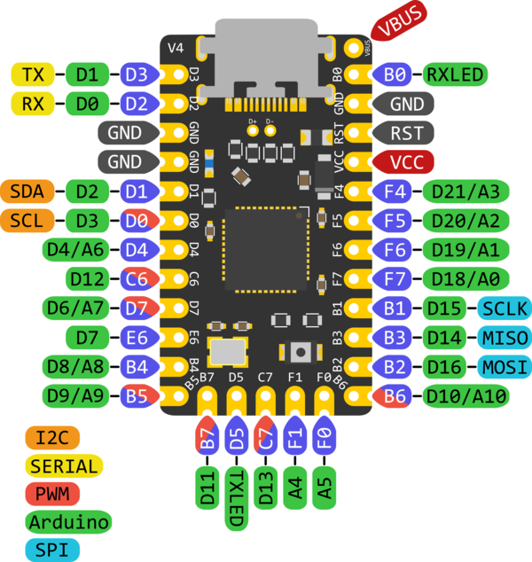

# Minisplit case

## Dimensions
```
pcb height: 75mm
pcb width: 132mm
```
```
switch hole mid-to-mid distance: 19mm
switch hole heigth: 14mm?
switch hole width: 14mm?
```
```
Usb hole from top: 0mm
Usb hole from origo: 2mm
Usb hole width: 15mm
```
```
TRRS from origo: 23mm
TRRS width: 19mm
```
```
PCB standoff height: 5.5mm?
PCB standoff diameter: 7mm
PCB standoff screw hole diameter: 2.5mm 
```


## Pinout
# Elite C

```
row1: D7
row2: E6
row3: B4
row4: B5
```
```
col1: B6
col2: B2
col3: B3
col4: B1
col5: F7
col6: F6
col7: F5
```


Meaby the build command
```
make splitti:default:dfu-split-left
```